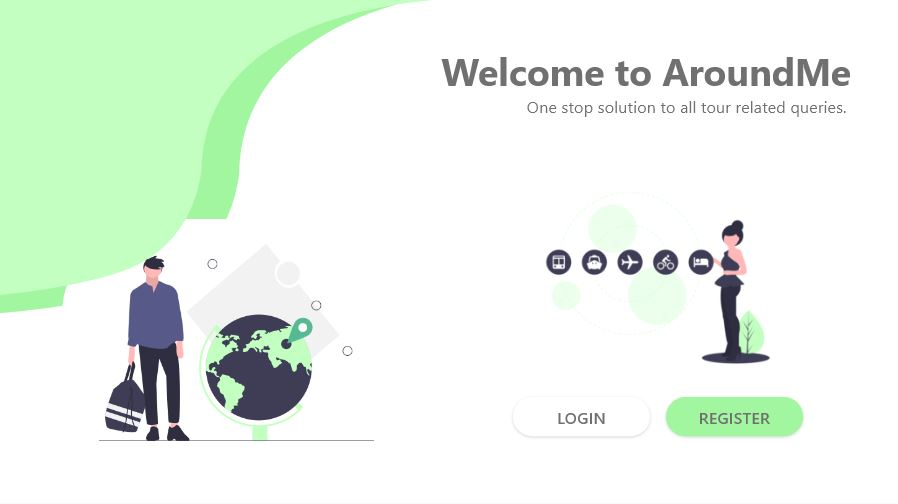

# Welcome to AroundMe
- If you've ever been on a tour, or ever ventured out to a new place, you'd often would have faced the difficulty of deciding what all to explore within the given time constraint, or what all to buy within a given budget ensuring that you're not overcharged by the local vendors.
- Or if you're running a business, sometimes you'd face the difficulty of pricing your product for the right market value, sometimes it'd be more than the market trends, and sometimes it'd be way lower.
- And one of the primary concern about conserving and preserving our local heritage is supporting the traditional craftsmen and artists, who find it quite hard to sell their artistry, a solution to sell off their handicrafts is definitely required as a local area highlight.

## Our Solution: 
If all these problems actually bug you, we bring to you **AroundMe**, an all in one web based solution for tourists, local vendors and tourist guides. A solution to ensure the fairness in finances from both the vendors point of view and the buyers point of view. And an assurance of having a fully fledged experience out of any places that one visits.

